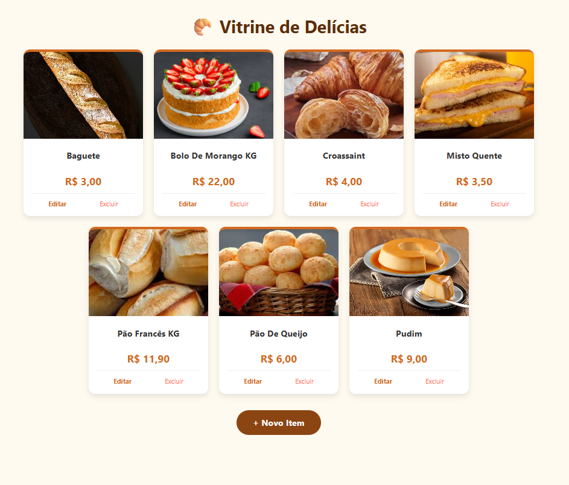
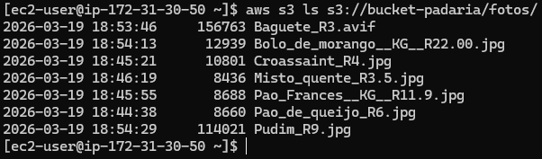
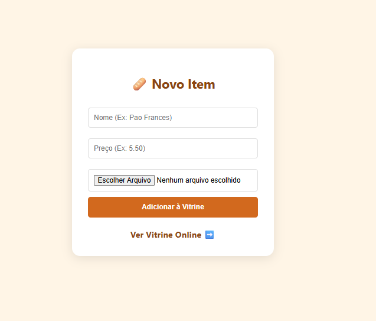
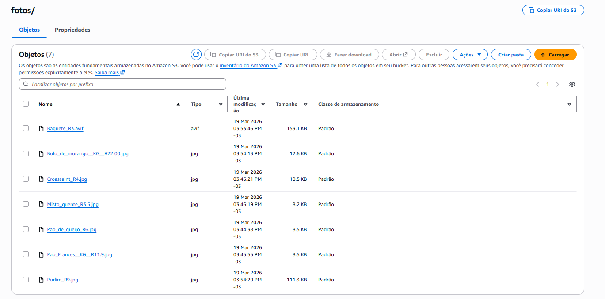

# 🥖 Vitrine de Padaria Cloud-Native

### Arquitetura de Redes, Computação e Storage na AWS

Este projeto marca o meu **início real na jornada Cloud**. Saí do zero absoluto no Linux e na AWS para construir, por conta própria, uma infraestrutura funcional de vitrine de padaria. Embora seja um projeto inicial, ele representa um grande passo para mim: o desafio de entender, na prática, como conectar servidores e armazenamento na nuvem de forma segura e independente.

> ⚠️ **Nota do Projeto:** Implementado em ambiente Sandbox AWS, com ciclo de vida temporário (3 horas) para fins de laboratório e validação de arquitetura.

---

## 🎯 O Desafio Técnico

O objetivo central era construir uma aplicação funcional onde o servidor web (**Amazon EC2**) permanecesse "limpo" (*stateless*). 

**O detalhe crucial:** As imagens não podem ocupar espaço no disco do servidor; elas são enviadas, armazenadas e lidas diretamente de forma segura através do **Amazon S3**.

  
   
  <em>Figura 1: Interface final da 'Vitrine de Delícias' rodando na EC2, consumindo imagens dinamicamente do S3.</em>

## 🛠️ Tecnologias e Ferramentas

* **Networking:** AWS VPC (Subnets, Internet Gateway, Route Tables).
* **Computação:** Amazon EC2 (Amazon Linux 2023).
* **Storage:** Amazon S3 (Bucket de objetos).
* **Segurança:** IAM Roles (Princípio de menor privilégio) e Security Groups.
* **Web Stack:** Apache (httpd) + PHP 8.x + AWS CLI.
* **Acesso & Dev:** PowerShell (SSH Nativo) e Editor Nano.

---

## ⚙️ Implementação Passo a Passo (Hands-on)

### 1. Fundação de Rede e Segurança
Em vez de usar a rede padrão, configurei uma VPC dedicada para isolar a aplicação:
* Criação de **Internet Gateway** e **Route Tables** para gerenciar o tráfego.
* Definição de **Security Groups** permitindo apenas as portas 80 (HTTP) e 22 (SSH restrito).
* **IAM Roles:** Configurei uma Role anexada à EC2 para que o servidor se autenticasse no S3 automaticamente, eliminando o uso de senhas ou *Access Keys* no código.

### 2. Validação via Terminal (CLI)
Antes de avançar para a interface, utilizei o AWS CLI via PowerShell para validar a conectividade entre a instância EC2 e o Bucket S3. Isso garantiu que as permissões de leitura/escrita estavam corretas.

  
   
  <em>Figura 2: Validação via terminal. Listagem de objetos no S3 (`aws s3 ls`) confirmando a comunicação direta entre instâncias.</em>

### 3. Desenvolvimento e Fluxo de Dados
O desenvolvimento foi realizado "Terminal-First", utilizando o editor **Nano** diretamente no servidor. Implementei lógica em PHP para:
1. Receber o arquivo via formulário.
2. Sanitizar nomes (remover acentos e espaços) para evitar quebras de link.
3. Realizar o *upload* para o S3 de forma transparente para o usuário.

  
   
  <em>Figura 3: Interface de upload. O arquivo escolhido aqui é processado pelo servidor e enviado imediatamente à nuvem.</em>

### 4. Persistência no Console S3
A prova real do desacoplamento: mesmo que a EC2 seja desligada, as imagens permanecem seguras e organizadas no bucket. No console, podemos observar os nomes já sanitizados pelo código PHP.

  
   
  <em>Figura 4: Console do S3 mostrando o armazenamento dos objetos de forma independente do servidor web.</em>

---

## 🧠 Aprendizados e Troubleshooting

Como este foi meu primeiro contato profundo com o ecossistema, enfrentei desafios reais:
* **Permissões de Diretório:** Aprendi a gerenciar permissões do Linux (`chmod`/`chown`) para que o usuário `apache` pudesse manipular arquivos temporários.
* **Logs do Apache:** Utilizei o `/var/log/httpd/error_log` para debugar erros de execução de comandos externos via PHP.
* **Gestão de Recursos:** Adaptação ao tempo limitado de laboratório (Sandbox), exigindo agilidade no provisionamento e configuração.

## 🚀 Funcionalidades

* ✅ **Upload Automático:** Integração direta com o SDK/CLI da AWS.
* ✅ **Arquitetura Stateless:** O servidor não armazena estado, facilitando a escalabilidade futura.
* ✅ **Sanitização de Arquivos:** Tratamento de nomes para evitar erros de renderização.
* ✅ **Interface Responsiva:** Cards otimizados para visualização em diferentes dispositivos.

---

## 💡 Visão de Futuro
Este projeto consolidou meu entendimento sobre como as peças de uma infraestrutura escalável se encaixam. Foi o passo inicial para construir aplicações que seguem as melhores práticas de *Cloud Computing*.

---
**Desenvolvido por Thiago Barbosa Carneiro**
[LinkedIn](https://www.linkedin.com/in/thiago-barbosa-carneiro-b3648a1b5/)
